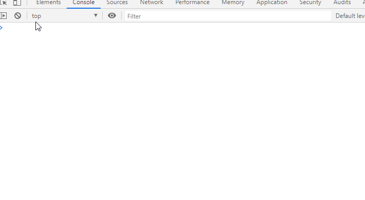

# Working with Chart.js

Before working in this section, I definitely recommend to install [VSCode IDE](https://code.visualstudio.com/Download). It supports almost all programming languages; provides different extensions for easy-coding, yet it has [Live Server](https://marketplace.visualstudio.com/items?itemName=ritwickdey.LiveServer) extension which I will be using during this workshop.

## Run your first JavaScript

1. If you are doing it in VSCode we, firstly, should create a file (let's say) `index.html` in directory. Then you open it; press <kbd>!</kbd> and then <kbd>Tab</kbd>, and you will have a basic template of Web-page:

    

2. Now we need to create a `JS` file; we can name it `script.js`, for example. Let's add a simple `JS` function there:

   ```JavaScript
   console.log("Our Script works!")
   ```

   So we can connect `script.js` with `index.html` just simply adding html `<script>` tag into `<head>`

   ```HTML
   <head>
    <meta charset="UTF-8">
    <meta name="viewport" content="width=device-width, initial-scale=1.0">
    <!-- This is our script.js loaded -->
    <script src="script.js"></script>
    <title>Document</title>
    </head>
    ...
   ```

   Now we either launch `Live Server` extension which will automatically refresh, once we add something in our files, or just simply open `index.html`. If you decide to use `Live Server` and it has been already added into your `VSCode` then on bottom-right angle you click icon `Go Live` and your `index.html` will automatically open in browser. Once you open `index.html`, press either <kbd>Ctrl</kbd>+<kbd>Shift</kbd>+<kbd>I</kbd> or right click mouse and <kbd>inspect</kbd>. There in `Console` tab you will see the output of our `script.js` first function `console.log("Our Script works!")`  

   .PNG)

   And that is it! Congrats with first `JS` function you made it. Obviously, this is elementary, but if you are familiar with `for loop`, `list()` functions in `R`, then `JS` will seem a very easy language to work with. I will cover small introduction to all necessary topics in the next section.

## Chart.JS

You can read more about Chart.JS [here](https://www.chartjs.org/) and it's [documentation](https://www.chartjs.org/docs/latest/getting-started/usage.html) which is straight-forward by the way. Download CDN is possible from [here](https://cdn.jsdelivr.net/npm/chart.js@2.9.3/dist/Chart.min.js). What is `Chart.js`? It `JavaScript` library which provides functions for creating an interactive visualization of your data. I have an experience to work with `R` visualization libraries (`ggplot`, `plotly`), and so far `Chart.js` is my favorite. I will explain why:

+ big community i.e. if you will face with error it is probably solved by someone else;

+ JS based i.e. there is no limit to build visualization which you want;

+ it is responsive and light i.e. thanks rendering in HTML5 Canvas it can be resizing and fast work with modern browsers.

### Extensions

There is a big community who work with `Chart.JS` and as it is open source there are plenty of good extensions presented. My favorite is therefore:

+ Data labels : [CDN](https://unpkg.com/chartjs-plugin-datalabels);

+ Chart Geo : [CDN](https://unpkg.com/chartjs-chart-geo@1.1.4/build/Chart.Geo.min.js).

+ Color Scemes : [CDN](https://nagix.github.io/chartjs-plugin-colorschemes/)

## Setting up Chart.js and our project

In order to load `Chart.js` library into project there are plenty of ways, we will consider the easiest for us using `<script>` tag in the same as it was with our `script.js`. Two options is available:

  1) put in props `src` attribute with link to actual [CDN](https://www.jsdelivr.com/package/npm/chart.js) (file named like `Chart.min.js`);
  2) copy-paste everything from [CDN](https://cdn.jsdelivr.net/npm/chart.js@2.9.3/dist/Chart.min.js) and store as separate `JS` script.

Second way is more secure, so let's follow this one:

+ create a file `Chart.js`;

+ open actual [CDN](https://cdn.jsdelivr.net/npm/chart.js@2.9.3/dist/Chart.min.js) and copy everything from there;
+ paste everything in `Chart.js` and save;
+ link script as we did with `script.js` in tag `<script>`.

That is it. Should be like this:

```HTML
<!DOCTYPE html>
<html lang="en">
<head>
    <meta charset="UTF-8">
    <meta name="viewport" content="width=device-width, initial-scale=1.0">
    <!-- Loading Chart.js -->
    <script src="Chart.js"></script>
    <!-- This is our script.js loaded -->
    <script src="script.js"></script>
    <title>Chart JS</title>
</head>
<body>

</body>
</html>
```

## JSON and fetching API

### JSON

If you have experience in ``R`` you might recently work with objects class `list()`, so `JSON` is basically list object which contains other objects (again `list()`) or values but for `JS`. `JSON` (JavaScript Object Notation) is a lightweight data-interchange format. It is easy for humans to read and write. It is easy for machines to parse and generate. Whenever you need to use data in `JavaScript` it is present as `JSON` object.

### API

For those who have no clue what is API (Application programming interface) it is just a list of functions and values which we access in order to use it in our applications or vise versa.

### `fetch()`

Function `fetch()` is build-in base `JS` function and it uses for getting response from API providers. Syntax is like:

```JavaScript
fetch('http://example.com/movies.json') //fetching to API provider
  .then((response) => { // same as function(response) {}
    return response.json(); //getting JSON object
  })
  .then((data) => {
    console.log(data); // Print output from JSON object
  })
```

### Sum up and get our first JSON object from API into our `index.html`

For this workshop I use COVID-19 Pandemic API from this source <https://pomber.github.io/covid19/timeseries.json>. So from API provider we will try to extract JSON object and `console.log()` in browser.

### Steps

1. Copy `fecth()` code above and paste into `script.js`;
2. replace example.com to this link <https://pomber.github.io/covid19/timeseries.json> in `fetch()`;

```JavaScript
console.log("Our Script works!")

fetch('https://pomber.github.io/covid19/timeseries.json')
  .then((response) => {
    return response.json();
  })
  .then((data) => {
    console.log(data);
  })
```

After these steps we can open `index.html` again and check output in console.



Congrats, you now can fetching data from API providers to build you projects! Now if you want to store this object as global variable we need just simply assign the empty object. **Note!** We need to create an empty object out of our `fetch()` or any other functions otherwise it's saved within a function and can't call out of it.

3. Assign empty object `var covidData;` to `JSON` object;

```JavaScript
var covidData; // creating empty object

fetch('https://pomber.github.io/covid19/timeseries.json')//API request
  .then((response) => {
    return response.json(); //Parse response to JSON object
  })
  .then((data) => {
    covidData = data; //assign name to object
  })

```

We have the global variable which we can use later in the visualization part.

## First simple chart with Chart.js

### Adding `<canvas>` to `index.html`

`Chart.js` working through `<canvas>` tag therefore in our `index.html` we need to add it under `<body>` tag. Let's add ID to this `<canvas>` as `"covid-chart-1"`

```HTML
...

<body>
    <canvas id="covid-chart-1"></canvas>
</body>
```

### Prepare data in `script.js`

We need to manipulate a little bit with our `covidData`. Unless we have UI, we will select only one country from the list and will work with this sample. Let's take **Latvia** or you might take what you prefer. If you remember i have mentioned similarity with JavasScript objects and List object in R. Basically, `covidData` is a list with `data.frames()` named by countries. So extract data which we need to filter data by name like that:

```JavaScript
covidData["Latvia"];
```

Time to build a function which will convert data in correct view for parsing in `Chart.js`. In order to do that we need to understand how our data should look like. In [the official documentation](https://www.chartjs.org/docs/latest/getting-started/) the simple example with structure is present:

```JavaScript
    data: {
        labels: ['January', 'February', 'March', 'April', 'May', 'June', 'July'],
        datasets: [{
            label: 'My First dataset',
            backgroundColor: 'rgb(255, 99, 132)',
            borderColor: 'rgb(255, 99, 132)',
            data: [0, 10, 5, 2, 20, 30, 45]
        }]
    }
```

`data` - object which has a structure:

+ `labels` - originally `x-axis` of chart
+ `datasets` - object with sets of data (in our case it is data from `selectedCovidData`);
  + `label` - Label of data sets. (for us is **Latvia**)
  + `data` - one of selected variable from `selectedCovidData` (`confirmed`; `deaths`; `recovered`)
  + `other` - setting colors or other attributes for each dataset provided.

Our data is currently looks like this:

```Javascript
console.log(selectedCovidData);
>   0: {date: "2020-1-22", confirmed: 0, deaths: 0, recovered: 0}
    1: {date: "2020-1-23", confirmed: 0, deaths: 0, recovered: 0}
    2: {date: "2020-1-24", confirmed: 0, deaths: 0, recovered: 0}
    3: {date: "2020-1-25", confirmed: 0, deaths: 0, recovered: 0}
    4: {date: "2020-1-26", confirmed: 0, deaths: 0, recovered: 0}
    5: {date: "2020-1-27", confirmed: 0, deaths: 0, recovered: 0}
    6: {date: "2020-1-28", confirmed: 0, deaths: 0, recovered: 0}
    7: {date: "2020-1-29", confirmed: 0, deaths: 0, recovered: 0}
    8: {date: "2020-1-30", confirmed: 0, deaths: 0, recovered: 0}
    9: {date: "2020-1-31", confirmed: 0, deaths: 0, recovered: 0}
    10: {date: "2020-2-1", confirmed: 0, deaths: 0, recovered: 0}
...
```

Well let's guessing. If we planning to make a simple linear chart, then for `x-axis` we should use `date`. For `label` we have already decided to use **Latvia**, then last step is to select one of left variables. Let's take `confirmed`. So let's build object data for further use.

### Array methods

In order to work with object in `JS` we can use [array methods](https://www.w3schools.com/jsref/jsref_obj_array.asp) which are very similar with `dplyr` main packages. I quick show example of syntax and you will understand.

---

**Task.** Filter data.frame in period between `"2020-02-29"` and `"2020-03-31"`; select `"confirmed"` column and return as numbers as array.

`dplyr R solution`

```R
# just quick data
x <- data.frame(date = seq(from = as.Date("2020-01-31"),
                           to = as.Date("2020-03-31"), by = "day" ),
               confirmed = c(1:61), death = 0, recovered = 2)
library("dplyr")
    x %>% filter(between(x = date,
    left = as.Date("2020-02-29"), right = as.Date("2020-03-31"))) %>% #filter dates
    select(confirmed) %>% # select confirmed variable
     pull() #transform to array
 ```

 `JavaScript array methods solution`

 ```JavaScript
 // create date bonds
var startDate = new Date("2020-02-29");
var endDate = new Date("2020-03-31");

// take our already existing object
// build a function that convert date to Date object and then filter
// Note! var date is assign within function so it is not stored as a global variable in browser
covidData["Latvia"].filter((data) => {
    var date = new Date(data["date"]); // convert array to Date
    return (date >= startDate && date <= endDate) // filter object
}).map(data => data["confirmed"]) // select confirmed
 ```

 So far we see that functions are similar to each other. `filter` in both cases is filtering out based on condition; `select` and `map` is basically the same functional.

### Summing up and apply function for data

Back to [the topic](###prepare-data-in-`script.js`). Now we can apply array method and build the structure of data which `Chart.js` is required in order to build a chart. I should quickly state that `JS` stack of functions runs a bit differently then in `R` for example i.e. it won't wait finalizing of `fetch()` and keep executes other functions which will cause errors in script. In order to avoid that we can you [`async await` functions](https://javascript.info/async-await). So it prevents next functions running until previous function is finished. At the end you will have something like this:

```JavaScript
var covidData; // creating empty object
var chartData; // creating empty object for chart needs

// fetching API data
const dataFromAPI = fetch('https://pomber.github.io/covid19/timeseries.json')
  .then((response) => {
    return response.json(); //convert response to JSON object
  })
  .then((data) => {
    return data; // return data
  })

  // async await function before page loaded
  window.onload = async () => {
    covidData = await dataFromAPI; // waiting when fetching function is done and assign value


    chartData = {
        labels: covidData["Latvia"].map(data => data.date), //select array with dates as x-axis
        datasets: [{
            label: 'Latvia, confirmed cases', //label of dataset
            data: covidData["Latvia"].map(data => data["confirmed"]), // array with confirmed numbers
            borderColor: 'Orange', //color of line
            backgroundColor: 'Orange', // color of background
            fill: false // don't fill chart
        }]
    }
    console.log(chartData) // just to see the result
  }
```

The output should be as on gif:


So we made it! It is basically the main thing for building `Chart.js`. Left things is add `type` of chart (for example let's stick with `line`), and our data (`charData`). *In general, `Javascript` is basically about `function()`, or  arrays (`[]`), or objects (`{}`)*. Now let's filled left things in our first chart object and finally open it by next steps:

1. assign context for our chart object;

```Javascript
var ctx = document.getElementById('covid-chart-1').getContext('2d');
```

2. create a new object `Chart`;

```Javascript
new Chart(ctx, {
    type: 'line',
    data: chartData
})
```

*Note!* that we have to put it under await function in order to be successful executed. Finally our `script.js` is like:

```JavaScript
var covidData; // creating empty object
var chartData = []; // creating empty object for chart needs

// fetching API data
const dataFromAPI = fetch('https://pomber.github.io/covid19/timeseries.json')
  .then((response) => {
    return response.json(); //convert response to JSON object
  })
  .then((data) => {
    return data; // return data
  })

  // async await function before page loaded
  window.onload = async () => {
    covidData = await dataFromAPI; // waiting when fetching function is done and assign value
    // chart data
    chartData = {
        labels: covidData["Latvia"].map(data => data.date), //select array with dates as x-axis
        datasets: [{
            label: 'Latvia, confirmed cases', //label of dataset
            data: covidData["Latvia"].map(data => data["confirmed"]), // array with confirmed numbers
            borderColor: 'Orange', //color of line
            backgroundColor: 'Orange',// color of background
            fill: false // don't fill chart
        }]
    }
    // connect canvas as context for Chart.js
    var ctx = document.getElementById('covid-chart-1').getContext('2d');
    // create a new Chart
    new Chart(ctx, {
        type: 'line',
        data: chartData
    })
  }
```

And you should see your first `Chart` in browser:


## Addition to Chart.js and extensions

### Add more countries or variables

What if we want to add more countries or add more variable such as `recovered` or `deaths`? I recently mentioned that `JS` is all about arrays `[]` and objects `{}`, so `Chart.js` data is array of objects, therefore we just need to add one more object in order to visualize more than one variable or country:

#### Adding other two variables

```Javascript
...
    // chart data
    chartData = {
        labels: covidData["Latvia"].map(data => data.date), //select array with dates as x-axis
        datasets: [{
            label: 'Latvia, confirmed cases', //label of dataset
            data: covidData["Latvia"].map(data => data["confirmed"]), // array with confirmed numbers
            borderColor: 'Orange', //color of line
            backgroundColor: 'Orange',// color of background
            fill: false // don't fill chart
        },
        {
            label: 'Latvia, deaths',
            data: covidData["Latvia"].map(data => data["deaths"]),
            borderColor: 'Red',
            backgroundColor: 'Red',
            fill: false
        },
        {
            label: 'Latvia, recovered cases',
            data: covidData["Latvia"].map(data => data["recovered"]),
            borderColor: 'Green',
            backgroundColor: 'Green',
            fill: false
        }
        ]
    }
...
```

Output:


#### Adding other country

Let's now add another county. So let's take last two of The Baltic states countries - `Lithuania` and `Estonia` and compare all three trend lines of confirmed cases.

```Javascript
...
    // chart data
    chartData = {
        labels: covidData["Latvia"].map(data => data.date), //select array with dates as x-axis
        datasets: [{
            label: 'Latvia, confirmed cases', //label of dataset
            data: covidData["Latvia"].map(data => data["confirmed"]), // array with confirmed numbers
            borderColor: 'Orange', //color of line
            backgroundColor: 'Orange',// color of background
            fill: false // don't fill chart
        },
        {
            label: 'Estonia, confirmed cases',
            data: covidData["Estonia"].map(data => data["confirmed"]),
            borderColor: 'Blue',
            backgroundColor: 'Blue',
            fill: false
        },
        {
            label: 'Lithuania, confirmed cases',
            data: covidData["Lithuania"].map(data => data["confirmed"]),
            borderColor: 'Grey',
            backgroundColor: 'Grey',
            fill: false
        }
        ]
    }
...
```

Output:


Great! But what if we have much more variables or countries we want to observe? Then we need a build function which will return an object with desired quantity:

```JavaScript
function chartDataFunc (countries, colors)  {
    let data = [] // empty array
    // for loop - create an object for each value in array countries
    for ( let country = 0; country < countries.length; country++) {

        let name = countries[country];

        data[country] = {
            label: name + ' confirmed cases',
            data: covidData[name].map(data => data["confirmed"]), // array with confirmed numbers
            borderColor: colors[country], //color of line
            backgroundColor: colors[country],// color of background
            fill: false // don't fill chart
        }
    }
    return data;
}
```

As we create a global variable which is not fired unless we want to; we don't need to set it under `await` and simply assign out of `async/await` function. Now we need to apply the function with condition to return an array of objects to our `Chart`

```JavaScript
...
    chartData = {
        labels: covidData["Latvia"].map(data => data.date), //select array with dates as x-axis
        datasets: chartDataFunc(["US","Germany","Italy", "Spain"],["black","green", "red", "orange"])
    }

...
```

Output:


#### Sum up

So far we now can use functions to build our objects for visualization. Moreover since full `HTML` could be modified and rewritten in `JavaScript` we can create a really fantastic, fast and unique visualization / dashboard with `Chart.Js`. Make it scalable or interactive by adding more and more functionality to our file.

### Custom extensions

The power of `Chart.js` is community and open-source. There thousands issues on stackflow and github have been solved, so to start working with `Chart.js` is very simple and if you stuck with problem it is, perhaps, already solved. Besided that, i want to cover in the section what i mentioned [earlier](###extensions). The list of popular extension is [here](https://github.com/chartjs/awesome), so you might check out and test it on your project furthers or build own one. Let's try to set [DataLabels](https://chartjs-plugin-datalabels.netlify.com/) and [Colorschemes](https://nagix.github.io/chartjs-plugin-colorschemes/). To work with that we need to add again in `index.html` a `<script>` with the link to priory saved script or load CDN right after `Chart.js` and before `script.js` as the functions should be assign in global environment before firing them.

```HTML
...
<head>
    <meta charset="UTF-8">
    <meta name="viewport" content="width=device-width, initial-scale=1.0">
    <!-- Loading Chart.js -->
    <script src="Chart.js"></script>
    <!-- Load Data Labels -->
    <script src="DataLabels.js"></script>
    <!-- Load Color Schemes -->
    <script src="ColorSchemes.js"></script>
    <!-- This is our script.js loaded -->
    <script src="script.js"></script>
    <title>Chart JS</title>
</head>
...
```

By default, `Data Labels` should already work with your chart in order to prevent appearance of them (for example we need labels only for specific data set) we can simple unregistered by following function pasted in `script.js`

```Javascript
// NOTE: when imported as a <script> tag, use the global property 'ChartDataLabels'
Chart.plugins.unregister(ChartDataLabels);
```

Regarding `Color Schemes` we need to adjust our `chartDataFunc` as we put colors arbitrary now we do not need, as well as manually assign `borderColor` and `backgroundColor` properties.

## Options

In previous section we added extension for displaying `Data Labels` but as we have a big numbers of variable and long data it was messy so in this section we will modify our `Chart` to deliver a good readability. Besides that one more things in `Chart` is `options`, so it is basically set up of you chart, reaction and visibility of it. The option is scriptable, so therefore we can always perform something unique for our chart.

### Hide overlapped labels

Remember, previously we have unregistered extension for all of our charts, so in order to register the extension to our chart we can add next attributes to `Chart` object.

```Javascript
    new Chart(ctx, {
        type: 'line',
        data: chartData,
       plugins: [ChartDataLabels] // register Labels in Chart
    })
```

If we want to change behavior of extension we need to add `options` property to object and add specification there:

```Javascript
    new Chart(ctx, {
        type: 'line',
        data: chartData,
       plugins: [ChartDataLabels], // register Labels in Chart
       options: {
           plugins : { // as we want to modify extension from plugins atribute above
            datalabels: { // ChartDataLabels settings
                display: 'auto', // prevent overlapping of labels
                align: 'top', // put values at top of points
                formatter: function(value, context) {
                    if (value < 1000) {
                        return "" ; // if cases less than 1000 we return empty value
                    } else {
                       return  (value / 1000).toFixed(0) + 'K' // round thousands to whole values
                    }
                }
            }

           }
       }
    })
```

Output


### Sum up

Options opens the possibility to modify everything in you chart like you willing to do. Almost all properties are scriptable so do more practice and you will do high level of visualization! Thanks!
